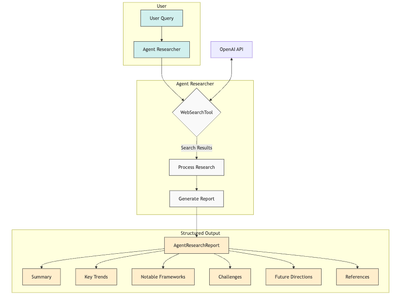
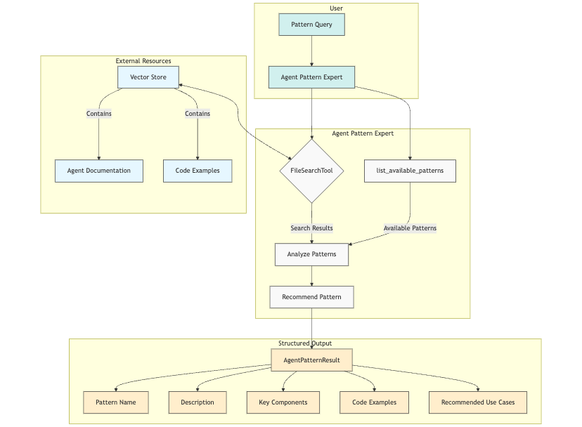
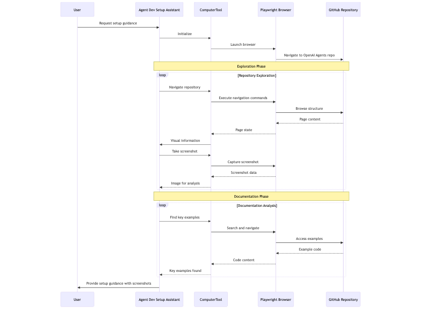

# Agent Examples Using OpenAI Agents SDK

This repository contains examples of AI agents that leverage the [OpenAI Agents SDK](https://openai.github.io/openai-agents-python/) built-in tools for agent-related tasks. 

These examples demonstrate how agents can help with developing, researching, and setting up other agents.

## Examples Overview

### 1. Search Agent

An agent that researches the latest developments in AI agents and autonomous systems using the WebSearchTool.



**Key Features:**
- Performs searches to gather current information about AI agent technologies
- Analyzes research results to identify trends, frameworks, and challenges
- Produces a structured report with detailed findings and references
- Uses the WebSearchTool with specific research instructions for AI agent development

**Use Cases:**
- Staying up-to-date with rapidly evolving agent technologies
- Researching specific agent frameworks or approaches
- Gathering information about best practices in agent development
- Identifying challenges and future directions in the field

### 2. File Search Agent

An agent that helps developers find relevant agent patterns and code examples using the FileSearchTool.



**Key Features:**
- Searches through vector-stored documentation to find relevant agent patterns
- Provides structured results with pattern descriptions and implementation details
- Suggests use cases where specific patterns would be most effective
- Includes code examples to help with implementation

**Use Cases:**
- Finding the right agent pattern for a specific use case
- Understanding implementation details of agent patterns
- Learning from existing code examples
- Getting recommendations on agent architecture design

### 3. Computer Use Agent

An agent that sets up and configures an agent development environment using the ComputerTool.



**Key Features:**
- Navigates GitHub repositories and documentation using browser automation
- Takes screenshots to help visualize the repository structure
- Identifies key examples and getting started guides
- Helps create initial project structure for a new agent

**Use Cases:**
- Setting up a development environment for agent building
- Learning repository structure through guided navigation
- Finding key examples in complex codebases
- Visual demonstration of agent development workflows

## Getting Started

1. Install the OpenAI Agents SDK:
```bash
pip install openai-agents
```

2. Set your OpenAI API key:
```bash
export OPENAI_API_KEY=your_api_key_here
```

3. Run any of the examples:
```bash
python examples/web_search_example.py
python examples/file_search_example.py
python examples/computer_use_example.py
```

## Requirements

- Python 3.9+
- OpenAI API key
- For computer use example: Playwright (`pip install playwright && playwright install`)
- For file search example: Vector store with agent documentation

## Diagrams

These diagrams were generated using Mermaid and illustrate the architecture and workflow of each example agent.